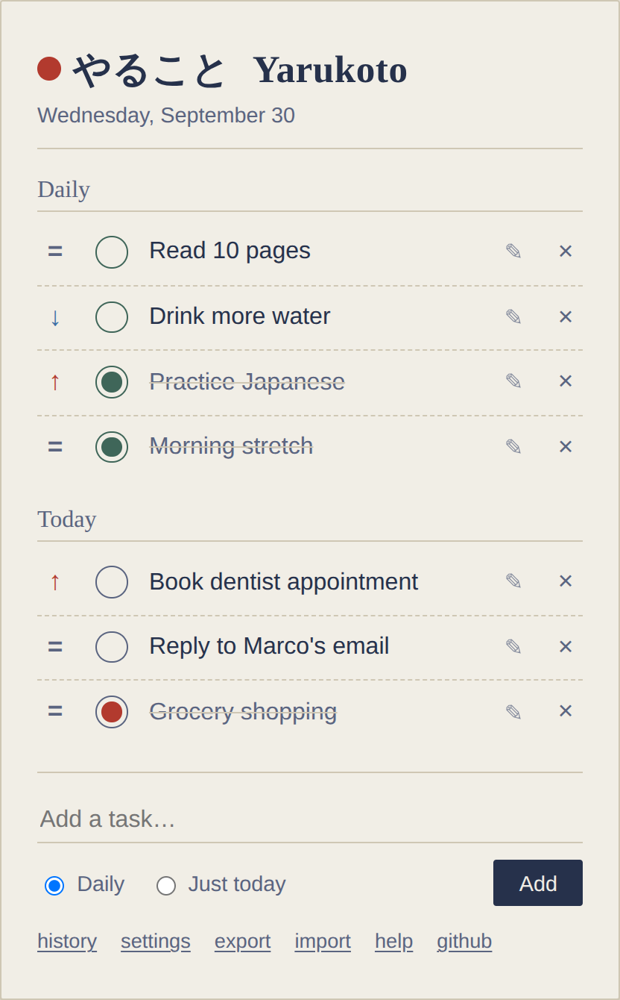

# Yarukoto (やること)

A small local-first daily task tracker. No account, no server, no sync: everything lives in your browser's local storage.

"Yarukoto" is Japanese for "things to do."

**Live:** [yarukoto.nextmiracle.eu](https://yarukoto.nextmiracle.eu/)



## How it works

- **Daily** tasks are habits: they reappear every day and reset to unchecked at midnight by default, or at a time you choose in settings (handy if your day runs past midnight). The switch happens on its own, even if the tab stays open or the computer slept through it. A history view shows the last 14 days per habit.
- **Today** tasks are one-off: if you don't finish one, it just stays on the list until you do, nothing is lost. Once checked, it stays visible with a strikethrough below the pending ones for the rest of the day (tap again to undo), then drops off the active list but stays logged in History.
- **Priority**: click the small marker next to a task to cycle `=` Normal, `↑` High, `↓` Low. Tasks sort by priority within their list.
- **Local only**: no backend, no accounts, nothing sent anywhere. Data stays in your browser via `localStorage`.
- **Export / import**: back up your data to a JSON file, or restore from one.
- **Intro**: a short visual tour opens on the very first launch. Reopen it any time from "help" in the footer.
- **Dark mode**: follows your OS/browser color-scheme preference automatically.

## Design

The look is meant to feel like the paper notebook the idea came from: ruled dividers, ink-colored text, and a small red stamp for a completed task, the kind of mark a hanko seal leaves. There's no build step and no component library behind any of it, just plain CSS custom properties for the two themes.

## Running it

No build step and no runtime dependencies. Either:

- Open `index.html` directly in a browser, or
- Serve the folder locally, e.g. `python3 -m http.server`, then visit `http://localhost:8000`

## Testing

The test suite boots the real `index.html` and `app.js` in jsdom, so no browser is needed. Install the dev dependencies once, then run the tests:

```sh
npm install   # dev dependencies only
npm test
```

CI runs the suite on pushes to `main` and on pull requests.

## Stack

Plain HTML, CSS, and JavaScript. No framework, no bundler. jsdom and Vitest are dev-only, for tests.

## About this project

I came up with the idea, decided what the app should and shouldn't do, and reviewed everything that went into it. The code itself was written almost entirely by LLMs, working from instructions and back-and-forth review rather than typed by hand line by line.

## License

MIT: see [LICENSE](LICENSE).
